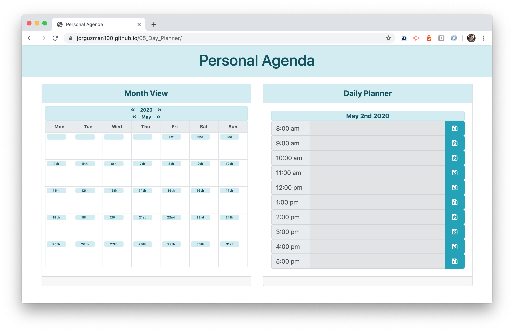
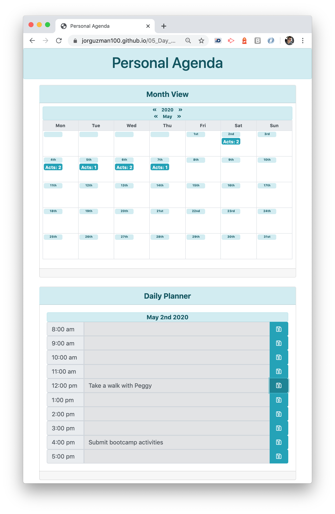

# 05_Day_Planner

A calendar application that works as a Personal Agenda, allowing the user to register activities at any day. Supports user's time planning wiht a month viewer.
Built with HTML, CSS, Bootstrap, JavaScript, jQuery and Moment.js.

## The Challenge

Create a calendar application that allows the user to save events for each hour of the day.

Main elements:

- [x] Calendar Month View
- [x] Daily Planner View

Additional characteristics:
This app will run in the browser and feature dynamically updated HTML and CSS powered by jQuery.

## The development process

In order to accomplish the challenge, the following steps were executed:

1. Define the purpose and plan the general idea of the application.
2. Define the base layout and grid, considering two stages:
   - Mobile-first approach.
   - Responsive design for larger screen sizes.
3. Search for assets (agenda references, icons, etc.)
4. Read Moment.js documentation.
5. Create Daily Planner functionality.
6. Create Month View functionality.
7. Apply semantic HTML.
8. Asses valid HTML.
9. Final review and proper documentation.

## The Output

With the described process we were able to create a efficient and responsive Personal Agenda application that display a Daily Planner for enter, change or remove activities, and supports the user's planning and review with a montly view.

**The application**

## Installation

The project was uploaded to [GitHub](https://github.com/) at the following repository:
[https://github.com/jorguzman100/05_Day_Planner](https://github.com/jorguzman100/05_Day_Planner)

You can access the deployed application with the GitHup Pages link:
[https://jorguzman100.github.io/05_Day_Planner/](https://jorguzman100.github.io/05_Day_Planner/)

## Tools and other References

[Bootstrap](https://getbootstrap.com/)

[Font Awesome](https://fontawesome.com/)

[Moment.js](https://momentjs.com/)

[Markup Validation Service](https://validator.w3.org/)
